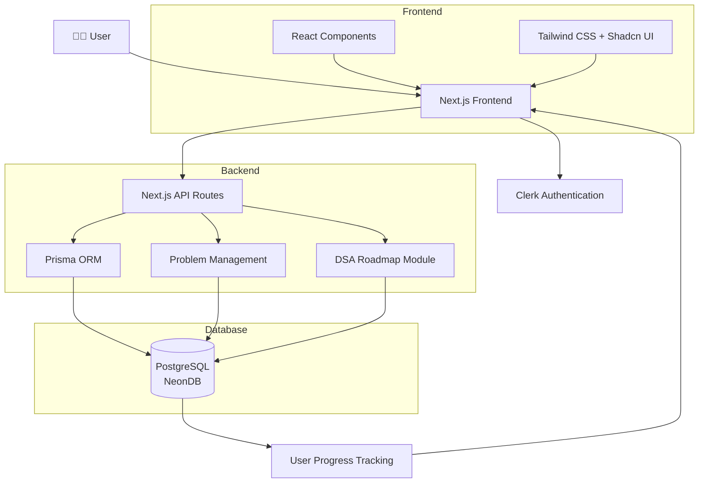

#  DevPrep

 A structured DSA preparation platform designed to help developers master Data Structures & Algorithms through curated roadmaps and coding problems.

DevPrep provides a guided learning path from fundamentals to advanced concepts, helping users improve problem-solving skills and prepare for competitive programming.

---

## 1. Features

###  DSA Roadmap

* Structured roadmap for mastering Data Structures & Algorithms
* Topic-wise learning progression
* Covers beginner to advanced concepts
* Follow a clear path instead of random problem solving

###  Problem Solving Platform

* Curated coding problems
* Problems categorized by difficulty:

  * 🟢 Easy
  * 🟡 Medium
  * 🔴 Hard
* Detailed problem statements
* Examples and constraints
* Practice problems to strengthen concepts

###  Progress Tracking

* Track completed problems
* Build consistency in DSA practice

###  Learning Path

Includes topics like:

* Core Programming Concepts
* Arrays
* Strings
* Linked Lists
* Stacks & Queues
* Recursion
* Searching & Sorting
* Hashing
* Trees
* Graphs
* Dynamic Programming
* Advanced Algorithms

---
## 2. System Architecture



## 3. Tech Stack

### Frontend

* Next.js
* React
* TypeScript
* Tailwind CSS
* Shadcn UI

### Backend & Database

* Prisma ORM
* PostgreSQL (NeonDB)

### Authentication

* Clerk Authentication

---

## 4. Project Structure

```text
DevPrep/
│
├── app/                 # Next.js routes
├── components/          # Reusable components
├── modules/             # Feature modules
├── prisma/              # Database schema
├── public/              # Static assets
├── lib/                 # Utilities
│
├── package.json
└── README.md
```

---

## 5. Installation

### Clone Repository

```bash
git clone https://github.com/Nikita-Saxena391/DevPrep.git
```

### Install Dependencies

```bash
npm install
```

### Setup Environment Variables

Create `.env.local`:

```env
# Database
DATABASE_URL="your_neon_database_url"

# Better Auth
BETTER_AUTH_SECRET="your_random_secret"
BETTER_AUTH_URL="http://localhost:3000"

# Application URL
NEXT_PUBLIC_APP_URL="http://localhost:3000"

# Google OAuth
GOOGLE_CLIENT_ID="your_google_client_id"
GOOGLE_CLIENT_SECRET="your_google_client_secret"

# Judge0 API
JUDGE0_API_URL="your_judge0_api_url"
JUDGE0_API_HOST="your_judge0_api_host"
JUDGE0_API_KEY="your_judge0_api_key"

# Clerk Authentication
NEXT_PUBLIC_CLERK_PUBLISHABLE_KEY="your_clerk_publishable_key"
CLERK_SECRET_KEY="your_clerk_secret_key"

NEXT_PUBLIC_CLERK_SIGN_IN_URL="/sign-in"
NEXT_PUBLIC_CLERK_SIGN_UP_URL="/sign-up"
NEXT_PUBLIC_CLERK_AFTER_SIGN_IN_URL="/"
NEXT_PUBLIC_CLERK_AFTER_SIGN_UP_URL="/"

# Groq AI
GROQ_API_KEY="your_groq_api_key"
```

### Run Prisma

```bash
npx prisma generate
npx prisma migrate dev
```

### Start Development Server

```bash
npm run dev
```

Open:

```text
http://localhost:3000
```

---

## 6. Roadmap

Future improvements:

* [ ] More DSA patterns
* [ ] Topic-wise quizzes
* [ ] Coding streak system
* [ ] Leaderboard
* [ ] Personalized learning paths
* [ ] Certificates on completion

---

